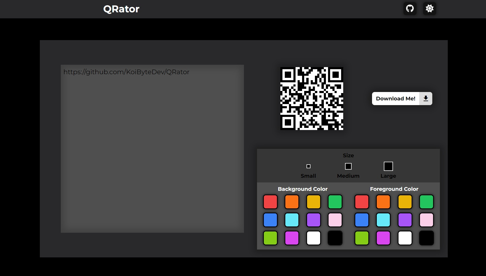

# QRator

QRator is a simple QR code generator that allows you to create customized QR codes. You can tailor the appearance of your QR codes by adjusting colors and sizes. The QR code updates automatically on input for a faster QR code generation.

## Introduction

Brief introduction to your project. Explain its purpose, features, and any other relevant information.

## Features

- Customization: Personalize your QR codes with a range of color options and size configurations.
- Automatic Updates: Generate your QR code instantly after any input.
- Versatile: QRator can be used to generate QR codes for websites, business cards, or even plain text.
